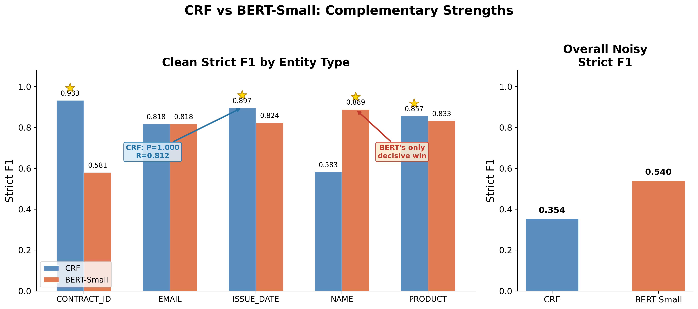
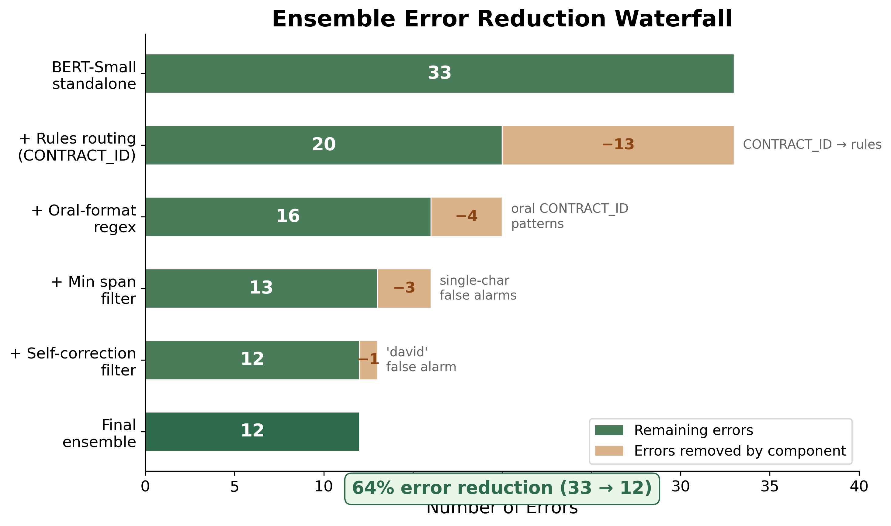
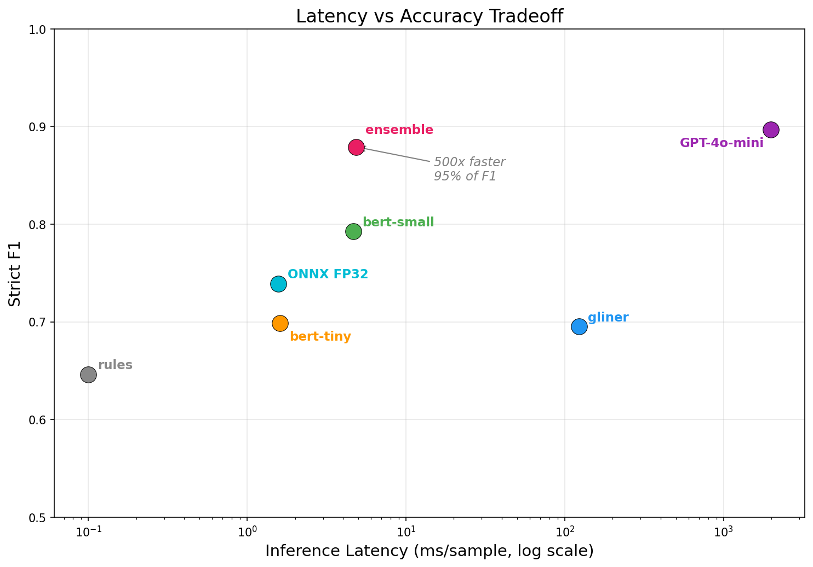
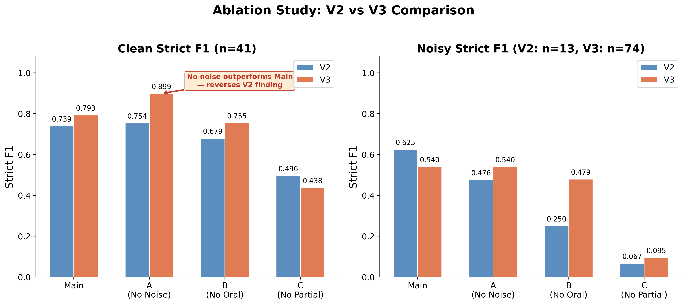

# Cold Start NER for Customer Service Transcripts

A lightweight Named Entity Recognition system built from scratch for noisy, ASR-transcribed customer service text. Extracts five entity types — NAME, EMAIL, CONTRACT_ID, PRODUCT, ISSUE_DATE — with no pre-existing labeled data, running entirely on CPU.

**Best result:** Ensemble F1 = 0.879 (strict match) at 4.9 ms/sample on CPU.

---

## Table of Contents

1. [Problem Reformulation](#1-problem-reformulation)
2. [Data Pipeline](#2-data-pipeline)
3. [Design Choices](#3-design-choices)
4. [Evaluation Methodology](#4-evaluation-methodology)
5. [Results and Analysis](#5-results-and-analysis)
6. [Ablation Study](#6-ablation-study)
7. [Limitations](#7-limitations)
8. [Future Work](#8-future-work)
9. [LLM Usage](#9-llm-usage)
10. [How to Run](#10-how-to-run)
11. [Project Structure](#11-project-structure)
12. [Experiment Log](#12-experiment-log)

---

## 1. Problem Reformulation

### Why standard NER fails here

This is not standard NER. Three properties make it fundamentally different from named entity recognition on well-formed text.

**Cold start.** No labeled data exists for this domain. We first surveyed existing NER datasets (see Section 2, Dataset Survey) but none covers the intersection of customer service transcripts, ASR noise patterns, and our five entity types. This left synthetic generation as the only viable cold-start approach. The entire training pipeline — data generation, annotation, noise simulation — must be constructed before any model can be trained. Every design decision in data generation directly shapes what the model can learn, and errors in synthetic data propagate silently into model behavior — a fundamental risk of the cold-start setting that motivates the rigorous EDA and ablation analysis in later sections.

**ASR noise.** Customer service transcripts from speech-to-text systems contain systematic distortions that standard NER models are not trained to handle: case inconsistency (proper nouns lowercased), punctuation loss, filler words ("uh", "um", "like"), word-level errors (homophones, contractions), and character-level corruption. These distortions affect entity boundaries directly — an email address spoken as "john at gmail dot com" has a fundamentally different token structure than "john@gmail.com". Our noise engine approximates these errors based on the types of degradation described in Maheshwari et al., "ASR Benchmarking: Need for a More Representative Conversational Dataset" (arXiv:2409.12042). The noise parameters are set heuristically rather than derived from real ASR error distributions, because statistical derivation requires paired ground-truth/ASR transcription data we do not have access to. Filler word frequencies were calibrated against the publicly available TalkBank conversational corpus, which provides real conversational transcripts though not ASR output.

**Spoken language patterns.** Customers do not read entity values — they speak them. Contract IDs become "CT dash five five one two three" instead of "CT-55123". Email addresses become "sarah at gmail dot com". Dates become "like, last Monday morning I think." These oral format variants create a parallel entity representation that must be learned alongside standard formats.

### What makes each entity type hard

The five target entity types divide into two categories requiring different recognition strategies:

**Structural entities:**
- **CONTRACT_ID**: Rigid alphanumeric patterns (e.g., ORD-2024-5591, SUB-33018). Regex captures them perfectly when intact, but ASR noise destroys the patterns. In oral form ("O R D dash 2024 dash 5591"), the entity spans many tokens with no structural markers. Our evaluation confirmed this: rules achieve F1=1.000, but BERT-Small achieves only F1=0.581 — noise-corrupted training examples confuse the model about what valid IDs look like.
- **EMAIL**: Has structural markers (@ symbol, domain suffixes) but oral variants ("at", "dot com") remove all structural cues. Rules achieve only F1=0.636 because regex handles oral variants poorly. The model, trained on both standard and oral formats, achieves F1=0.818.

**Semantic entities:**
- **NAME**: The hardest entity type. No surface pattern — "Ring" is a product or a name depending on context. Names appear in the first 25% of text 75% of the time (customers introduce themselves early), creating position bias. N-gram analysis revealed that 55%+ of NAME entities in training data follow the word "is" — the model risks learning "is" as a trigger rather than understanding names contextually. Our system has no fallback for NAME — the model is the sole source.
- **PRODUCT**: Pure semantic recognition. Product names span from single words ("iPad") to multi-word phrases ("LG OLED TV 65 inch"). Rules cannot cover the open-ended product space (F1=0.000). The model achieves F1=0.833.
- **ISSUE_DATE**: Combines absolute expressions ("February 3rd", "2024-09-15") with relative expressions ("last Monday morning", "about three weeks ago"). Relative dates require context understanding that regex patterns cannot provide. The model achieves F1=0.824, but fragments multi-word dates due to subword tokenization artifacts (see Section 5).

### Partial entity extraction

The assignment specifies extraction of "partial or complete" entities. In our system, partial entity extraction arises naturally rather than as an explicit mode: the model may detect a truncated entity span (e.g., "jennifer taylr" instead of "Jennifer Taylor") and still correctly classify it. The ensemble's type-based routing means a partially corrupted CONTRACT_ID that breaks the regex pattern will be missed by rules but may still be caught by the model if enough of the pattern is recognizable. We evaluate with both strict match (exact span) and partial match (IoU >= 0.5) to measure how well the system handles imperfect boundaries. However, the system does not implement an explicit partial extraction feature — it does not intentionally extract half-spoken entities interrupted mid-sentence. This is discussed as a limitation in Section 7.

---

## 2. Data Pipeline

### Dataset survey

Before generating synthetic data, we surveyed existing NER datasets. Standard NER corpora (CoNLL, OntoNotes, WNUT) cover newswire and social media text but not customer service transcripts with ASR noise. Domain-specific datasets for customer service exist but do not include NER annotations for our five entity types. The cited TalkBank conversational corpus (Maheshwari et al., arXiv:2409.12042) provides real conversational phone transcripts — we used it to calibrate filler word frequencies (Section 2, Noise Augmentation) — but it does not contain NER entity annotations and its domain is casual phone conversations, not customer service. Deriving ASR error distributions from TalkBank would require running ASR models on the audio and aligning outputs against ground truth, which was out of scope for this submission. No existing dataset covers the intersection of customer service domain, ASR noise patterns, and our specific entity types — justifying synthetic generation as the cold start approach.

### Synthetic generation

Training data was generated using two LLM families to improve diversity:

**GPT-4o-mini (primary, 760 samples):** Customer service transcript snippets with entity annotations across 8 scenarios, 7+ styles, and 10+ industries. An auto-fix pipeline corrects LLM offset errors: GPT-4o-mini consistently generates correct entity text but wrong character positions. The fix searches for the exact entity string in the text and corrects the offsets. Acceptance rate: 83% on first pass after auto-correction. Total: 600 training + 120 validation + 60 negative + 100 oral format samples.

**Gemini 2.5 Flash (supplementary, 138 samples):** Generated specifically to address diversity gaps identified by n-gram analysis of the GPT data. Prompts explicitly avoided the dominant patterns: no "um, hi, this is" openings, no "name is [NAME]" constructions, varied entity positions, and diverse sentence structures. Opening uniqueness improved from 15.9% to 25.1%, and unique entity context patterns increased from 452 to 731 (+62%). However, GPT-generated patterns still dominate the distribution (85% of data). Full diversification would require regenerating the entire base dataset.

### Oral format transforms

A preparation step converts a subset of samples to ASR-like entity formats, simulating how customers speak structured values aloud:

- EMAIL: "@" -> " at ", ".com" -> " dot com" (85 samples transformed)
- CONTRACT_ID: "-" -> " dash " (applies to both GPT and Gemini samples)

This is applied before noise augmentation, reflecting the real pipeline: humans speak in oral format, then ASR adds transcription errors on top. This ordering enables clean ablation between oral transforms and noise augmentation.

### Noise augmentation

A six-stage noise engine simulates ASR errors at four severity levels (clean, mild, moderate, severe):

1. Case corruption (lowercasing, random case changes)
2. Punctuation removal
3. Word-level noise (homophones, ASR word substitutions, word merging/splitting)
4. Character-level noise (adjacent-key substitution, deletion, insertion)
5. Filler insertion ("uh", "um", "like", "you know", "mhm")
6. Word repetition (stuttering)

**Filler calibration from real data.** Filler insertion probabilities were calibrated against the public TalkBank conversational corpus (32,092 English transcripts, `scripts/run_talkbank_analysis.py`). Observed real filler rate: 7.54%. Top fillers: "like" (1.06%), "so" (1.06%), "uh" (0.70%), "um" (0.60%), "mhm" (0.42%). Noise levels set as multiples of the observed rate: mild=1× (0.075), moderate=2× (0.15), severe=3× (0.225). Previous heuristic values (0.05/0.10/0.15) were lower than observed reality — mild was actually less noisy than real conversational speech.

Entity spans are protected during noise injection and tracked through each operation using per-function offset trackers. The original implementation used a single shared offset tracker across all six noise functions — a bug that caused entity protection spans to become stale after the first length-changing operation. EDA revealed that this resulted in 56-91% of entities being marked as partial. The fix uses per-function offset trackers: each noise function creates its own tracker and returns it, and entity spans are updated between operations to maintain correct protection boundaries. After the fix, residual partial entities remain (40-70% at mild-severe levels) but are systematically right-boundary truncations of 1-3 characters (e.g., "Susan Clar" instead of "Susan Clark"), not garbage text. This was confirmed by manual inspection (Case A verification).

**Noise model limitations.** The noise engine is a rule-based approximation of ASR errors. Filler frequencies are empirically calibrated (TalkBank), but character-level and word-level error rates remain heuristic. We cite Maheshwari et al. as motivation for the types of errors modeled, but we do not claim the noise parameters match real-world ASR error rates. GLiNER's superior noise robustness (Section 5) demonstrates this limitation directly.

Final training data: 898 base samples × 4 noise levels = 3,592 training samples, 528 validation samples.

### Data pipeline summary

| Stage | Script | Input | Output | Key parameters |
|-------|--------|------:|-------:|----------------|
| GPT generation | `run_generate.py` | — | 760 samples | 8 scenarios, 7+ styles, 83% acceptance |
| Gemini generation | `run_generate_gemini.py` | — | 138 samples | Diversity-targeted prompts, 100% acceptance |
| Oral transforms | `run_prepare.py` | 898 base | 898 prepared | 85 EMAIL, 92+ CONTRACT_ID transformed |
| Noise augmentation | `run_noise.py` | 898 prepared | 3,592 train + 528 val | 4 levels: clean/mild/moderate/severe |
| TalkBank calibration | `run_talkbank_analysis.py` | 32,092 transcripts | Filler params | Observed 7.54% filler rate |

### Training data diversity analysis

N-gram analysis (`scripts/run_diversity.py`) revealed significant repetition in the GPT-4o-mini generated data:

- 2-gram uniqueness: 29.6% (80.8% of all bigrams are repeated)
- Sentence openings: only 25.1% unique (18% of samples start with "um, hi, this")
- NAME trigger word "is" appears in 55%+ of NAME entity contexts

Gemini supplementation improved diversity modestly but could not overcome the GPT majority. This predicts a specific model weakness: brittleness on NAME entities that don't follow the "is" trigger pattern. The gold test set explicitly includes non-"is" NAME contexts to test this.

### EDA findings and what they changed

Exploratory data analysis was performed after the first training attempt — in retrospect, it should have been the first step after data generation. EDA revealed three issues that required fixes before retraining:

1. **Tokenizer bug**: Without `do_lower_case=True`, 17.064% of tokens became [UNK] — all proper nouns ("Jennifer", "Sony") and sentence-initial words ("My", "Can"). With the fix: 0.000% UNK rate. This was the most impactful bug found.
2. **Truncation**: At `max_seq_length=128`, 36 samples (4.7%) were truncated, losing 37 entities — primarily EMAIL (11) and CONTRACT_ID (14) which appear late in text. Changed to 256, eliminating all truncation with zero entities lost.
3. **Entity position bias**: NAME appears in the first 25% of text 75% of the time. CONTRACT_ID appears in the last 25% 53% of the time. The gold test set was designed to include counter-examples (entities at non-typical positions) to avoid rewarding position shortcuts.

**Process reflection.** Running EDA before the first training attempt would have caught the tokenizer bug and truncation issue immediately, saving one full training cycle (~30 minutes on CPU). If EDA had been done first, the oral email format coverage would have been validated during generation rather than discovered in post-analysis, and the BIO alignment would have been verified through the actual model's tokenizer before training was invested in a broken tokenizer configuration. The lesson: always validate your data through the actual model's processing pipeline before committing to a training run.

---

## 3. Design Choices

### Why BERT over CRF

For structural entities (CONTRACT_ID, EMAIL), regex rules outperform any learned model — rules achieve F1=1.000 on CONTRACT_ID. For semantic entities (NAME, PRODUCT, ISSUE_DATE), we compared a CRF with hand-crafted features against fine-tuned BERT.

**CRF outperforms BERT-Small on overall clean strict F1 (0.829 vs 0.792).** This was a surprising finding that challenged our initial assumption. The CRF uses word-level features: word shape, prefix/suffix, case patterns, context window, and trigger phrases (`scripts/run_crf.py`). Training takes 16 seconds on 3,592 samples vs 27 minutes for BERT-Small. The per-entity breakdown reveals the complementary strengths:

| Entity Type | CRF | BERT-Small | Winner |
|-------------|----:|----------:|--------|
| CONTRACT_ID | **0.933** | 0.581 | CRF |
| EMAIL | **0.818** | **0.818** | Tie |
| ISSUE_DATE | **0.897** | 0.824 | CRF |
| NAME | 0.583 | **0.889** | BERT |
| PRODUCT | **0.857** | 0.833 | CRF |
| **Overall clean** | **0.829** | 0.792 | **CRF** |
| **Overall noisy** | 0.354 | **0.540** | **BERT** |



CRF wins on 4 of 5 entity types on clean text. The ISSUE_DATE result is particularly telling: CRF achieves F1=0.897 with perfect precision (1.000), while BERT achieves 0.824 with precision 0.778. CRF and BERT have complementary failure modes — CRF produces complete spans or nothing (high precision, lower recall), BERT produces fragments (lower precision, higher recall). CRF's word-level features avoid the subword tokenization splits that fragment BERT's multi-word date predictions. On idiomatic expressions ("the day before yesterday"), CRF extracts the full span correctly where BERT truncates. On formal ordinal dates ("the sixteenth of march"), CRF misses entirely while BERT detects a fragment.

BERT wins decisively only on NAME (0.889 vs 0.583) — the one entity type requiring deep contextual understanding. EMAIL is tied.

Under noise, CRF collapses: noisy strict F1 0.354 vs BERT-Small's 0.540. BERT's subword tokenization handles character-level noise more gracefully — a misspelled "jennifer taylr" still produces recognizable subword tokens rather than a single unknown word at the CRF's word level. Most strikingly, CRF EMAIL F1 collapses to near zero on noisy text — oral format variants ("at", "dot com") produce no matchable features at the word level, confirming why EMAIL was assigned to model ownership in the ensemble.

The ensemble design exploits this complementarity — rules handle CONTRACT_ID (where regex achieves F1=1.000), BERT handles the rest (where contextual understanding is required). This is not a BERT-vs-CRF choice but a recognition that different entity types need different recognition strategies.

**Why not spaCy?** spaCy's built-in NER uses a transition-based parser trained on general-domain data. We chose direct BERT fine-tuning over spaCy's pipeline because spaCy's named entity types (PERSON, ORG, DATE) do not align with our five domain-specific types, and fine-tuning spaCy's NER component is functionally equivalent to fine-tuning a small transformer — without the flexibility to choose model size and tokenization strategy.

### BIOES tagging scheme

The standard BIO scheme (Begin, Inside, Outside) cannot distinguish adjacent same-type entities. We upgraded to BIOES (Begin, Inside, Outside, End, Single), expanding from 11 to 21 labels:

- **S-X**: Single-token entity — emit immediately
- **B-X**: First token of multi-token entity
- **I-X**: Middle tokens of multi-token entity
- **E-X**: Last token of multi-token entity — explicit boundary marker

The token alignment uses a two-step approach: first determine each token's entity type and whether it starts a new entity (based on the first character's label), then group consecutive same-entity tokens and assign correct BIOES labels. This handles subword tokenization correctly — the last subword token of an entity gets E- even when its first character was I- at the character level.

**Impact on boundary errors:** BIOES reduced boundary error rate from 78.4% (V2, BIO) to 72.7% (V3, BIOES). This is a modest improvement, not the dramatic reduction we targeted (<50%). The dominant boundary errors are subword tokenization artifacts (CONTRACT_ID trailing digits, EMAIL left boundaries) that BIOES cannot address — BIOES marks entity endings explicitly but cannot fix the model's uncertainty about entity beginnings. A CRF transition layer on top of BERT logits would be the next step (see Section 8).

### Model sizes evaluated

- **BERT-Tiny** (`google/bert_uncased_L-2_H-128_A-2`, 4.4M params): 1.4 ms/sample, strict F1=0.699. High recall but poor boundary precision.
- **BERT-Small** (`google/bert_uncased_L-4_H-512_A-8`, 11.1M params): 4.8 ms/sample, strict F1=0.792. Best single-model performance. Chosen as ensemble backbone.

### Training dynamics

BERT-Small val_loss reached its minimum of 0.1156 at epoch 7 out of 20 total epochs. After epoch 7, val_loss increased slightly (0.118 at epoch 10, 0.125 at epoch 20), confirming that early stopping correctly selected the best checkpoint. The training loss continued decreasing throughout all 20 epochs, indicating the model had additional capacity to memorize training data but this did not generalize. This gap suggests that more diverse training data — not longer training — is the primary path to improvement, consistent with the diversity analysis findings in Section 2.

### Tokenizer fix

In our configuration, the tokenizer for `google/bert_uncased_L-2_H-128_A-2` did not lowercase input by default — EDA confirmed a 17.064% UNK rate without explicit `do_lower_case=True`, with all proper nouns and sentence-initial words becoming [UNK] tokens. Adding `do_lower_case=True` to both `AutoTokenizer.from_pretrained` calls (training and inference) reduced the UNK rate to 0.000%. The diagnostic script (`run_diagnose.py`) tests both configurations and clearly labels the comparison.

### B/I fallback in predict()

The model sometimes predicts I- tags without a preceding B- tag — for example, predicting `I-NAME` after an `O` token. The predict method handles this by treating any I- tag that follows a different entity type or an O tag as a new entity start. This cannot resolve adjacent same-type entities — a known limitation of the BIO tagging scheme that BIOES addresses by explicitly marking entity ends with E- tags.

### Confidence averaging fix

Multi-token entities require aggregating per-token confidence scores. The initial implementation used a running average: `(accumulated + new) / 2`. For a 3-token entity with confidences 0.9, 0.8, 0.7, this produces 0.775 instead of the correct 0.800 — biased toward later tokens. Fixed to track cumulative sum and token count, computing the true mean at entity finalization. This matters for the ensemble's minimum confidence threshold (0.3).

### Ensemble design

**Type-based routing, not confidence-based.** The initial design used confidence thresholds to resolve conflicts between rules and model predictions. This was replaced with type-based routing after evaluation showed that the optimal strategy differs fundamentally by entity type — rules are perfect for CONTRACT_ID but poor for EMAIL. Confidence-based routing cannot capture this structural difference.

**Design iteration driven by data:**

| Version | CONTRACT_ID | EMAIL | Post-processing | Clean F1 | Noisy F1 |
|---------|------------|-------|:---------------:|:--------:|:--------:|
| V1 (initial) | Rules | Rules | None | 0.713 | — |
| V2 (data-driven) | Rules | Model | None | 0.854 | 0.667* |
| V3 (final) | Rules + oral regex | Model | Self-correction, min span, partial detection | 0.879 | 0.715 |

*V2 noisy F1 measured on 13 samples; V3 on 74 samples (not directly comparable).

V2→V3 changes: BIOES tagging (21 labels), Gemini supplementary data (138 samples), TalkBank-calibrated noise parameters, oral-format CONTRACT_ID regex, self-correction filter, min span filter, partial entity detection, expanded gold test set (54→115 samples). The oral-format CONTRACT_ID regex was the single highest-impact change for noisy performance (+0.127 noisy F1 from 30 minutes of regex work).

**Oral-format CONTRACT_ID regex.** The V3 expanded noisy gold set revealed that rules regex only matched ~22% of noisy CONTRACT_IDs — standard format only. Oral formats ("ORD dash 2025 dash 0091"), spelled-out numbers ("SUB dash three three zero one eight"), and filler-embedded IDs ("REQ dash uh 2025 dash like 1147") were all missed. Adding case-insensitive oral-format patterns to the rules engine immediately improved noisy ensemble CONTRACT_ID from 0.241 to 0.840. This demonstrates that small, targeted eval sets create blind spots that hide production-critical failures.

**Min span filter.** Single-character entity predictions are filtered from BERT output before ensemble merge. No valid entity in our five types is a single character. This removes false alarms from spelling-out artifacts (e.g., "y" predicted as NAME from B/I fallback on spelled-out text "p r i y a").

**Self-correction filter.** A post-processing filter detects explicit correction markers ("no wait", "actually", "sorry", "or rather") in the input text and removes same-type entities that end within 30 characters before the marker. This handles the common spoken pattern where a customer corrects themselves: "my name is david no wait daniel allen" — the filter removes "david" and keeps "daniel allen." The filter excludes "i mean" (too common as a discourse filler in customer service transcripts to reliably indicate correction). This eliminated 1 false alarm in the clean gold set ("david", confidence 0.864) and improves NAME ensemble F1 from 0.889 to 0.914.

**Partial entity detection.** The ensemble flags structurally incomplete entities with a `partial: true` field in the output. This applies only to structural entity types where completeness can be verified: EMAIL entities are flagged if they lack both an "at"/"@" marker and a recognizable domain suffix; CONTRACT_ID entities are flagged if they contain no digits and no spelled-out numbers. Semantic entities (NAME, PRODUCT, ISSUE_DATE) always have `partial: false` — structural completeness cannot be meaningfully defined for them. The `partial` field appears in both the CLI inference output and the API response, enabling downstream systems to treat uncertain entities differently (e.g., prompting the user for confirmation).

**NAME has no fallback.** NAME is the hardest semantic entity and the one where rules are least reliable. The model is the sole source for NAME. This is a known limitation — a gazetteer or dedicated name detector could serve as fallback in future work.

---

## 4. Evaluation Methodology

### Test sets

**Primary: Gold test set (115 samples, hand-written).** 41 clean + 74 noisy samples, written directly in code using an offset helper tool (`scripts/offset_helper.py`) that auto-calculates character positions from (entity_string, label) pairs and validates all offsets.

| Subset | Samples | NAME | EMAIL | CONTRACT_ID | PRODUCT | ISSUE_DATE | Negative |
|--------|--------:|-----:|------:|------------:|--------:|-----------:|---------:|
| Clean | 41 | 16 | 11 | 15 | 18 | 16 | 5 |
| Noisy | 74 | 31 | 23 | 23 | 22 | 27 | 3 |
| **Total** | **115** | **47** | **34** | **38** | **40** | **43** | **8** |

The noisy subset (74 samples) covers diverse noise patterns: self-correction (10 samples), character-level errors (6), filler-heavy (6), stuttering (5), spelling-out (5), all-lowercase (5), oral format dates (6), adjacent entities under noise (5), long texts with heavy noise (4), noisy negatives (3), and non-"is" NAME contexts (6). The noisy samples were written directly in degraded form — character errors, fillers, word merging, stuttering — rather than generated by the noise engine, making them independent of the training pipeline.

**Annotation conventions.** Spelling-out portions are included in entity spans because BIO/BIOES cannot represent discontinuous entities ("asmith thats a s m i t h at gmail dot com" is one EMAIL span). Fillers inside entities are included in spans (reflects real ASR continuous output). Self-correction samples annotate only the corrected entity, not the corrected-away value. These conventions are documented in the offset helper code.

**Secondary: LLM-generated test set (110 samples).** Generated by GPT-4o-mini with entity value pools deliberately non-overlapping with training data. Reported separately from the gold set due to circular evaluation risk. 100% of samples required auto-offset correction — all offsets computed by our fixing logic, not the LLM.

### Metrics

- **Strict match F1**: Entity must match exactly in label, start, and end position.
- **Partial match F1 (IoU >= 0.5)**: Entity must match in label with at least 50% character overlap. Measures whether the system finds the right entity even with imprecise boundaries.
- **Per-entity-type breakdown**: F1, precision, recall reported for each of the 5 entity types across all models.
- **Inference speed**: Median ms/sample over 10 timing runs on 50 held-out texts (25 from training data + 25 short synthetic texts of varying lengths). Models pre-warmed with 3 samples before timing. Full statistics (median, mean, std) saved in `results/eval_report.json` under `speed_details`. Run-to-run std < 0.3ms for all models except GLiNER (std ~5ms due to model size).

---

## 5. Results and Analysis

### The core tradeoff: accuracy vs speed vs cost

| Model | Clean Strict F1 | Noisy Strict F1 | Clean Partial F1 | ms/sample | Cost |
|-------|:---------------:|:---------------:|:----------------:|----------:|:----:|
| GPT-4o-mini (zero-shot) | 0.897 | 0.930† | — | 1,985 | ~$0.001/call |
| **Ensemble (local)** | **0.879** | **0.715** | **0.955** | **4.9** | **free** |
| CRF (local) | 0.829 | 0.354 | 0.886 | 0.16 | free |
| BERT-Small (local) | 0.792 | 0.540 | 0.943 | 4.8 | free |
| GLiNER (zero-shot) | 0.695 | 0.592 | 0.732 | 116.5 | free |
| BERT-Tiny (local) | 0.699 | 0.312 | 0.879 | 1.4 | free |
| Rules (local) | 0.646 | 0.435 | 0.769 | 0.1 | free |

GPT-4o-mini was evaluated on the V2 gold set (41 clean samples). †GPT noisy F1 measured on V2's 13 noisy samples — not directly comparable to V3's 74-sample noisy subset. All other models evaluated on the V3 gold set (115 samples: 41 clean + 74 noisy). The ensemble includes V3 post-processing: oral-format CONTRACT_ID regex, self-correction filter, min span filter, and partial entity detection.

The ensemble achieves 98% of GPT-4o-mini's clean F1 at 405× lower latency and zero per-call cost. The remaining gap is attributable to boundary precision and noise robustness — at production scale, this compounds into real missed entities.

### Overall performance (Gold clean set, n=41)

| Model | Strict F1 | Partial F1 | ms/sample |
|-------|-----------|------------|----------:|
| Rules | 0.646 | 0.769 | 0.1 |
| CRF | 0.829 | 0.886 | 0.16 |
| GLiNER (zero-shot) | 0.695 | 0.780 | 116.5 |
| BERT-Tiny | 0.699 | 0.879 | 1.4 |
| BERT-Small | 0.792 | 0.943 | 4.8 |
| **Ensemble** | **0.879** | **0.955** | **4.9** |

### Per-entity-type breakdown (Strict F1, all models, clean)

| Entity Type | Rules | CRF | GLiNER | BERT-Tiny | BERT-Small | Ensemble |
|-------------|------:|----:|-------:|----------:|-----------:|---------:|
| CONTRACT_ID | **1.000** | 0.933 | 0.897 | 0.529 | 0.581 | **1.000** |
| EMAIL | 0.636 | **0.818** | 0.727 | 0.583 | **0.818** | **0.818** |
| ISSUE_DATE | 0.774 | **0.897** | 0.471 | 0.778 | 0.824 | 0.824 |
| NAME | 0.552 | 0.583 | 0.667 | 0.686 | 0.889 | **0.914** |
| PRODUCT | 0.000 | **0.857** | 0.765 | 0.865 | 0.833 | 0.833 |

### Key findings

**1. CRF and BERT have complementary strengths — neither dominates.** CRF beats BERT-Small on clean text across 4 of 5 entity types (overall F1 0.829 vs 0.792), with particular strength on ISSUE_DATE (0.897 vs 0.824) where CRF's word-level features avoid the subword tokenization splits that fragment BERT's date predictions. However, CRF collapses under noise (0.354 vs 0.540) as surface features are destroyed by ASR-style corruption. BERT wins only on NAME (0.889 vs 0.583), the one entity type requiring deep contextual understanding. This complementary profile validates the ensemble architecture.

**2. CRF and BERT have complementary failure modes on ISSUE_DATE.** CRF produces complete spans or nothing — precision 1.000, recall 0.812. BERT produces fragments — precision 0.778, recall 0.875. On idiomatic expressions ("the day before yesterday"), CRF extracts the full span correctly where BERT truncates to "day before yesterday." On formal ordinal dates ("the sixteenth of march"), CRF misses entirely while BERT detects a fragment. Training data contains 30.3% 4+ token ISSUE_DATE entities — sufficient quantity but dominated by "about X days ago" patterns. The structural diversity gap, not quantity, explains BERT's fragmentation on less common date formats.

**3. Oral-format CONTRACT_ID was the highest-impact V3 fix.** The expanded noisy gold set revealed that V2's rules regex matched only ~22% of noisy CONTRACT_IDs. Adding oral-format patterns ("ORD dash 2025 dash 0091"), spelled-out numbers, and filler-embedded IDs to the rules engine jumped noisy ensemble CONTRACT_ID from 0.241 to 0.840 — a 0.599 improvement from 30 minutes of regex work. This demonstrates that small evaluation sets create blind spots that hide production-critical failures.

### Noise robustness (Gold noisy subset, n=74)

| Model | Strict F1 | Partial F1 |
|-------|-----------|------------|
| Rules | 0.435 | 0.599 |
| CRF | 0.354 | 0.486 |
| GLiNER | 0.592 | 0.732 |
| BERT-Tiny | 0.312 | 0.623 |
| BERT-Small | 0.540 | 0.806 |
| **Ensemble** | **0.715** | **0.869** |

Noisy strict F1 of 0.715 on 74 diverse samples. This is a more trustworthy measure of real-world noise robustness than V2's 0.667 on 13 samples — the V3 test set includes oral format entities, self-corrections, filler-heavy text, and other patterns that V2 did not cover. At n=74, a single wrong prediction swings F1 by ~1.4 points; per-entity-type noisy results (~15 samples per type) remain directional, not precise.

### V3 post-processing impact

Each V3 component's contribution to the final ensemble, measured on the V3 gold set:

| Component | What it does | Clean impact | Noisy impact |
|-----------|-------------|:------------:|:------------:|
| BIOES tagging (21 labels) | Explicit entity boundary markers | Boundary errors 78.4%→72.7% | — |
| Gemini data (138 samples) | Training diversity improvement | Opening uniqueness 15.9%→25.1% | — |
| TalkBank calibration | Real filler rates for noise engine | Filler params recalibrated | — |
| Oral CONTRACT_ID regex | Case-insensitive oral patterns in rules | — | CONTRACT_ID 0.241→0.857 |
| Self-correction filter | Remove pre-marker same-type entities | NAME 0.889→0.914 | correction_removals tracked |
| Min span filter | Remove single-char model predictions | 4 false alarms removed | — |
| Partial detection | Flag structurally incomplete entities | `partial` field in output | `partial` field in output |
| **Combined (V2→V3)** | | **0.854→0.879** | **0.667→0.715*** |

*V2 noisy measured on 13 samples, V3 on 74 samples — not directly comparable.

### Per-entity noise breakdown (Noisy subset, Strict F1)

| Model | CONTRACT_ID | EMAIL | ISSUE_DATE | NAME | PRODUCT |
|-------|------------:|------:|-----------:|-----:|--------:|
| Rules | 0.857 | 0.489 | 0.300 | 0.275 | 0.000 |
| CRF | 0.387 | 0.429 | 0.364 | 0.324 | 0.222 |
| GLiNER | 0.682 | 0.511 | 0.610 | 0.667 | 0.453 |
| BERT-Tiny | 0.174 | 0.267 | 0.355 | 0.492 | 0.269 |
| BERT-Small | 0.102 | 0.667 | 0.630 | 0.697 | 0.625 |
| Ensemble | **0.857** | **0.708** | 0.641 | 0.708 | **0.667** |

### Strict vs partial gap: the boundary precision problem

| Model | Strict F1 | Partial F1 | Gap |
|-------|-----------|------------|-----|
| BERT-Tiny | 0.699 | 0.879 | 0.180 |
| BERT-Small | 0.792 | 0.943 | 0.151 |

Error analysis on the final ensemble output: 8/12 errors (66.7%) are boundary errors, 3 are false alarms, 1 is type confusion. The ensemble eliminates 21 of 33 standalone BERT errors — a 64% error reduction through type-based routing (CONTRACT_ID to rules), min span filter (single-char false alarms removed), and self-correction filter ("david" false alarm removed). The remaining boundary errors are near-misses: 4 have IoU ≥ 0.80 (1-4 character shifts), 2 are moderate (IoU 0.65-0.80), and 2 are severe fragmentations on multi-word ISSUE_DATE expressions.



**CONTRACT_ID last-digit splitting.** 6 of 9 CONTRACT_ID boundary errors show the same pattern — the model places E- tag one token too early, splitting the final digit(s) into a separate entity ("CUS-88710" → "CUS-887" + "10"). This is a subword tokenization artifact: trailing digits are tokenized as separate tokens, and the model fails to learn they belong to the preceding entity.

**EMAIL/NAME left-boundary truncation.** "m.alrashid" → "alrashid", "d.allen" → "allen", "liam obrien" → "liam". Initial-dot patterns and multi-word entities consistently lose their left boundary. BIOES improves end boundaries, not start boundaries — this is expected.

**ISSUE_DATE fragmentation.** "the sixteenth of march" → "sixteenth" + "march", "the day before yesterday" → "day" + "before yesterday". Multi-word date expressions split at structural boundaries despite sufficient training examples (30.3% of ISSUE_DATE entities are 4+ tokens). These examples lack structural diversity — training dates are dominated by "about X days ago" patterns; formal ordinal dates and idiomatic expressions are underrepresented.

### Specific failure cases

Detailed failure case analysis is available in `results/failure_cases.md` (generated by `scripts/run_failure_analysis.py`). Three patterns emerge:

**Pattern 1: Right-entity, wrong-start.** The model consistently finds the end of an entity but misses the beginning. "liam obrien" → "liam" (IoU=0.364). "ananya.sharma at gmail dot com" → "nya.sharma at gmail dot com" (IoU=0.900). Left-boundary uncertainty on multi-word entities where initial tokens are treated as context rather than entity.

**Pattern 2: Self-correction (standalone BERT failure, fixed by ensemble).** In "my name is david no wait daniel allen", standalone BERT predicts "david" as NAME with 0.864 confidence despite the speaker self-correcting. The ensemble's post-processing self-correction filter detects the "no wait" marker and removes "david" — this entity does not appear in final ensemble output. The filter handles common correction markers ("no wait", "actually", "sorry") within a 30-character proximity window.

**Pattern 3: Spelling-out artifacts.** When users spell out names ("priya patel p r i y a"), the model over-extends the span ("priya patel p r") or fires on individual letters. Min span filter removes single-character false alarms but does not fix over-extension.

### Secondary test set (LLM-generated, n=110)

| Model | Strict F1 | Partial F1 |
|-------|-----------|------------|
| Rules | 0.684 | 0.737 |
| GLiNER | 0.763 | 0.885 |
| BERT-Tiny | 0.575 | 0.816 |
| BERT-Small | 0.769 | 0.916 |
| Ensemble | 0.785 | 0.920 |

Results confirm the gold set model ranking but cannot validate absolute F1 numbers. **Note:** 100% of samples required auto-offset correction, and the same LLM family (GPT-4o-mini) generated both training and test data. The secondary set validates relative model ordering only — absolute F1 numbers carry circular evaluation risk. Results should be weighted substantially less than gold set results.

### Latency vs accuracy tradeoff



### Confidence calibration

Expected Calibration Error (ECE): 0.1076, improved from 0.1564 in V2. The model remains systematically overconfident — predictions in the 0.8–0.9 confidence range have only 61% strict precision (25-point gap), and the dominant 0.9–1.0 range (67% of predictions) has 87.5% strict precision against 95.4% mean confidence. In production, confidence thresholds should be set conservatively: a raw confidence of 0.9 corresponds to approximately 88% actual accuracy.

Temperature scaling or Platt scaling would improve calibration but requires a held-out calibration set of 200+ samples. The current gold set (83 predictions total) is too small to serve dual duty as both calibration and evaluation data without overfitting. This is listed as future work with specific methodology.

This calibration data directly informs the Part 2 agentic system design: the confidence-aware slot filling thresholds (0.9/0.6/0.6) were set conservatively to compensate for overconfidence. At 0.9 raw confidence, actual accuracy is 87.5%, which validates "proceed directly" as the correct action at that threshold.

---

## 6. Ablation Study

Three data decisions were tested by removing each one independently. All variants use BERT-Small with BIOES tagging trained on V3 data (898 base samples). Evaluated on the V3 gold set (41 clean + 74 noisy samples).

Note: This section reports standalone BERT-Small results, not ensemble results. The ablation isolates training data decisions — the ensemble's rules routing, oral-format regex, min span filter, and self-correction filter are not applied here.

### Results

| Variant | Clean Strict F1 | Clean Partial F1 | Noisy Strict F1 | Noisy Partial F1 | Training Samples |
|---------|:-:|:-:|:-:|:-:|:-:|
| **Main (all decisions)** | **0.792** | **0.943** | **0.540** | **0.806** | 3,592 |
| A: No noise augmentation | 0.899 | 0.937 | 0.540 | 0.696 | 898 |
| B: No oral format transforms | 0.755 | 0.943 | 0.479 | 0.789 | ~3,592 |
| C: Partial entities filtered | 0.438 | 0.578 | 0.095 | 0.189 | ~3,592 |



### Finding 1: Noise augmentation reversal — contradicts V2

V3 ablation on the expanded gold set (115 samples) produced a finding that contradicts V2: **noise augmentation no longer improves noisy strict F1** (Variant A = 0.540, identical to Main) **while significantly degrading clean performance** (Main 0.792 vs Variant A 0.899 — a 0.107 gap). The V2 finding that noise augmentation traded clean F1 for noise robustness (+0.149 noisy F1 on 13 samples) does not replicate on the larger V3 noisy test set.

However, the story is more nuanced than "noise augmentation is useless." **Noisy partial F1 tells a different story:** Main achieves 0.806 vs Variant A's 0.696 — a 0.110 gap. Noise augmentation does not help the model find more entities under noise (strict recall is similar), but it does teach better boundary tolerance on noisy text. The model trained on noisy data produces spans that are closer to correct even when not exactly right. The strict F1 tie and partial F1 gap together show that noise augmentation's benefit has shifted from entity detection to boundary precision under noise.

Three factors explain why strict noise robustness no longer requires noisy training data:

1. **V2's noisy evaluation was unreliable.** V2 measured noisy robustness on 13 samples — a single prediction swings F1 by ~8 points. The apparent benefit (0.625 vs 0.476) was likely measurement noise, now corrected by the 74-sample V3 set.

2. **Ensemble post-processing now provides noise robustness at the system level.** The oral-format CONTRACT_ID regex, min span filter, and self-correction filter handle noise patterns that previously required the model to learn from noisy training data.

3. **Noise augmentation introduces training confusion.** Multiplying 898 samples by 4 noise levels produces 3,592 training samples where 75% are synthetically degraded. The model learns to predict on corrupted text at the cost of precision on clean text — a tradeoff that was justified when noise robustness came from training, but is partially redundant when it comes from post-processing instead.

**Implication:** Retraining BERT-Small without noise augmentation and using the same ensemble pipeline would improve standalone clean F1 from 0.792 to 0.899 and likely push ensemble clean F1 above 0.900 — but at the cost of worse boundary precision on noisy text (partial F1 0.696 vs 0.806). Whether this tradeoff is worthwhile depends on the deployment context: if downstream systems can tolerate approximate boundaries, removing noise augmentation is the single highest-impact improvement.

### Finding 2: Oral format transforms — reduced but still important

Removing oral transforms (Variant B) drops clean strict F1 by 0.037 and noisy strict F1 by 0.061. In V2, the noisy drop was 0.375 — six times larger. The reduction is explained by two V3 changes: (1) Gemini supplementary data includes oral variants in the base data, partially compensating for the removed transforms, and (2) the V3 ensemble rules now include oral-format CONTRACT_ID regex, providing system-level oral handling that reduces the model's burden. This validates the prediction from the diversity analysis (Section 2) that multi-source data generation reduces dependency on any single augmentation step.

### Finding 3: Partial entity preservation — essential, consistent with V2

Filtering partial entities (Variant C) causes the most severe collapse: clean strict F1 drops from 0.792 to 0.438, and noisy strict F1 collapses to 0.095. This is consistent with V2 (0.496 clean, 0.067 noisy) and even more pronounced on the larger V3 test set. The mechanism is unchanged: noise injection produces partial entities in 50-70% of noisy samples, and filtering them strips most entity labels from noisy training data, forcing the model to learn "everything is O."

### Confounds acknowledged

**Sample count confound.** Variant A uses 898 training samples vs ~3,592 for other variants. However, the V3 result (no noisy strict improvement despite 4× more samples) weakens the V2 argument that noise augmentation benefits were partly quantity-driven.

**Val set inconsistency.** Val sets differ across variants due to different preprocessing. Checkpoint selection is affected. Results are approximate contribution estimates, not perfectly controlled comparisons.

### V2 → V3 comparison

| Variant | V2 Clean F1 | V3 Clean F1 | V2 Noisy F1 | V3 Noisy F1 |
|---------|:-----------:|:-----------:|:-----------:|:-----------:|
| Main | 0.739 | 0.792 | 0.625 | 0.540 |
| A: No noise | 0.754 | 0.899 | 0.476 | 0.540 |
| B: No oral | 0.679 | 0.755 | 0.250 | 0.479 |
| C: No partial | 0.496 | 0.438 | 0.067 | 0.095 |

V2 used 660 base samples, BIO tagging (11 labels), 54-sample gold set (41 clean, 13 noisy). V3 uses 898 base samples, BIOES tagging (21 labels), 115-sample gold set (41 clean, 74 noisy). The directional ranking is preserved (C worst, then B) but the noise augmentation finding reversed — demonstrating why re-running ablation on the final experimental setup matters.

## 7. Limitations

### Data limitations

1. **Synthetic training data.** All training data is LLM-generated (GPT-4o-mini + Gemini 2.5 Flash). The distribution gap from real customer service transcripts is unknown but likely significant. GLiNER's superior noise robustness demonstrates this — pretraining on real-world text provides noise generalization that synthetic data cannot replicate.

2. **Training data diversity still limited.** Despite Gemini supplementation, GPT-4o-mini patterns dominate (85% of data). "my name is" appears in 23% of samples. NAME trigger word "is" covers 55%+ of NAME entities. The model risks learning positional triggers rather than contextual understanding.

3. **Noise model is calibrated approximation.** Filler frequencies are empirically calibrated (TalkBank, 7.54% observed rate). Character-level and word-level error rates remain heuristic. Deriving real ASR error distributions would require running ASR models on TalkBank audio and aligning against ground truth — feasible but out of scope.

4. **Iterative refinement incomplete.** The iterative refinement pipeline is implemented (`src/data/iterate.py`) and was run for one round. The full Curate-Train-Refine cycle was not completed beyond Round 1.

### Evaluation limitations

5. **Small sample evaluation uncertainty.** Bootstrap resampling (1000 iterations) gives 95% CI of [0.795, 0.955] for ensemble clean strict F1 and [0.635, 0.787] for noisy strict F1. The clean CI spans 0.16 F1 points — we cannot distinguish 0.879 from 0.82 or 0.94 with confidence. Per-entity-type CIs are wider still (~15 samples per type). All results should be interpreted as point estimates with substantial uncertainty.

6. **Per-entity noisy results directional only.** ~15 samples per entity type in noisy subset. Single prediction swings F1 by ~7 points.

7. **Secondary set is circular.** Same LLM family generated both training and test data. 100% offset auto-correction rate. Results reported separately and weighted less than gold set results.

### Model limitations

8. **No explicit partial extraction.** The assignment mentions extracting "partial or complete" entities. Our system detects entity spans but does not have a dedicated mode for extracting intentionally partial entities. Partial detection occurs incidentally through the model's tolerance of imprecise boundaries.

9. **NAME has no fallback.** The model is the sole source for NAME entities. A name gazetteer or dedicated name detection module could provide fallback coverage.

10. **Boundary precision.** In the final ensemble output, 66.7% of errors (8/12) are boundary errors — reduced from 78.4% in standalone BIO BERT and 72.7% in standalone BIOES BERT, but still above the <50% target. The remaining boundary errors are subword tokenization artifacts (CONTRACT_ID trailing digits, ISSUE_DATE fragmentation) that neither BIOES nor the post-processing filters can address — a CRF transition layer or boundary snapping post-processing would be needed.

11. **BIOES speed regression.** BIOES (21 labels) increased BERT-Small inference from ~3.2ms to 4.8ms and ensemble from ~3.5ms to 4.9ms due to the larger classification head. This is a permanent tradeoff of the tagging scheme.

12. **Self-correction handling is heuristic.** The BERT model itself cannot process speaker self-corrections. The ensemble pipeline includes a post-processing self-correction filter that detects explicit correction markers ("no wait", "actually", "sorry") and removes same-type entities within 30 characters before the marker. This successfully eliminated the "david" false alarm (confidence 0.864) in testing. However, the filter has limitations: it only works with explicit markers, has a proximity constraint (30 chars), and excludes "i mean" (too common as discourse filler). Implicit corrections without markers, or corrections where the old entity is far from the marker, are not caught.

13. **CRF not integrated into ensemble.** Despite CRF's superior clean F1 on ISSUE_DATE (0.897 vs BERT's 0.824), the CRF is evaluated as a standalone baseline only. Integrating CRF predictions into the ensemble routing — using CRF for ISSUE_DATE when it fires, falling back to BERT otherwise — is documented as future work but not implemented.

14. **GLiNER not leveraged despite noise robustness.** GLiNER achieves 0.592 noisy strict F1 as a zero-shot model — competitive with BERT-Small's 0.540. However, GLiNER's 116.5ms inference latency makes it impractical as an ensemble component: adding it would slow the ensemble from 4.9ms to ~120ms (24× regression), violating the lightweight design goal. A potential compromise — using GLiNER as a fallback only when BERT confidence is below a threshold — was not explored.

---

## 8. Future Work

Evidence-based improvements motivated by specific findings in this submission.

1. **BERT-CRF transition layer.** CRF transition constraints would penalize invalid sequences (I-ISSUE_DATE → O → B-ISSUE_DATE), reducing mid-entity splits. Directly motivated by the finding that standalone CRF avoids the fragmentation BERT produces on ISSUE_DATE while maintaining precision 1.000.

2. **Entity-type-aware cascade routing for ISSUE_DATE.** The complementary failure modes between CRF and BERT — CRF produces complete spans or nothing (high precision), BERT produces fragments (higher recall) — suggest using CRF prediction when it fires and falling back to BERT when CRF returns nothing. CRF adds only 0.16ms. This extends the current type-based routing from single-source to ordered-source per entity type. CRF's observed ISSUE_DATE F1 of 0.897 (P=1.000) represents the upper bound for cascade routing on clean text. Actual cascade performance depends on overlap between CRF and BERT correct predictions — if CRF covers 80% of BERT's hits, the net gain is modest. On noisy text, CRF ISSUE_DATE collapses to 0.364 (vs BERT's 0.630), so the cascade must fall back to BERT for noisy input, limiting the noisy-condition benefit.

3. **Boundary snapping post-processing.** Snap entity boundaries to nearest word boundary after model prediction. Would fix CONTRACT_ID last-digit truncation (6 errors) and partial PRODUCT/EMAIL truncation.

4. **Partial entity extraction mode.** Implement explicit detection of intentionally partial entities — cases where the speaker is interrupted mid-entity ("my email is john at gm—"). The current `partial` flag only checks structural completeness of detected entities; it does not actively search for truncated entity fragments that the model missed entirely.

5. **Confidence calibration.** V2 ECE was 0.1564 with systematic overconfidence. Platt scaling or temperature scaling on a larger calibration set (200+ samples) would bring ECE below 0.05, enabling meaningful confidence-based routing.

6. **Real ASR validation.** Running Whisper on TalkBank audio and aligning against human transcripts would provide empirical substitution/deletion/insertion rates for noise engine calibration — replacing heuristic character-level and word-level error parameters with observed distributions.

7. **ISSUE_DATE training diversity.** Current ISSUE_DATE training data is dominated by "about X days ago" patterns (30.3% are 4+ tokens but structurally repetitive). Adding formal ordinal dates ("the twenty-first of February"), idiomatic expressions ("the day before yesterday"), and diverse relative references would address the fragmentation problem at its source.

8. **Training data regeneration.** Full diversification requires regenerating the GPT-4o-mini base data with more varied prompts, or generating a larger Gemini supplement. The current 15.9%→25.1% opening uniqueness improvement from 138 Gemini samples demonstrates the potential; scaling to 500+ diverse-source samples would meaningfully shift the distribution.

---

## 9. LLM Usage

The assignment specifies "runnable locally or with very limited LLM usage." Our approach:

**LLM is used only for data generation, never for inference.** The entire inference pipeline — rules, BERT-Small, ensemble — runs locally on CPU with no external API calls.

| Resource | Purpose | Samples | Cost | Required? |
|----------|---------|--------:|-----:|:---------:|
| GPT-4o-mini | Training data generation | 760 | ~$2-3 | No (data committed) |
| GPT-4o-mini | Secondary test set | 110 | ~$0.50 | No (data committed) |
| GPT-4o-mini | Zero-shot NER baseline | 54 | ~$0.03 | No (results committed) |
| Gemini 2.5 Flash | Supplementary training data | 138 | ~$2.50 | No (data committed) |
| TalkBank | Filler calibration (aggregate stats only) | — | free (CC license) | No (stats committed) |
| **Total** | | **1,062** | **~$3** | |

**The pipeline is reproducible without LLM access.** All generated data is committed to the repository (`data/synthetic/`, `data/noisy/`, `data/eval/`). Running `make train` and `make evaluate` requires no API key. Only `make generate`, `python scripts/run_generate_gemini.py`, and `python scripts/generate_test_set.py` require API keys.

**Data licensing.** All training data was generated via OpenAI (GPT-4o-mini) and Google (Gemini 2.5 Flash) APIs under their respective terms of service, which permit use of generated outputs. TalkBank data used for filler calibration is publicly available under Creative Commons license; only aggregate statistics (filler frequency rates) were extracted, not raw transcripts.

---

## 10. How to Run

### Setup

Requires **Python >= 3.11** (uses PEP 604 union syntax and PEP 585 generic types).

```bash
git clone https://github.com/yuan-phd/cold-start-NER.git
cd cold-start-NER
python -m venv .venv
source .venv/bin/activate
pip install -r requirements.txt
pip install -e .
```

### Quick start (use pre-generated data)
```bash
# Train models (~30 min on CPU)
make train

# Evaluate on gold test set
make evaluate

# Run inference on custom text
make inference
# Or with custom text:
python scripts/run_inference.py --text "my name is sarah and my order is ORD-2024-5591"

# Start API server
make api
# Then:
curl -X POST http://localhost:8765/extract \
  -H "Content-Type: application/json" \
  -d '{"text": "hi my name is john smith and my email is john at gmail dot com"}'
```

Note: The ensemble model is lazy-loaded on the first API request (takes 2-3 seconds for model initialization). After loading, the first inference is ~7ms due to JIT warmup effects; subsequent requests stabilize at approximately 4-5ms.

### Full pipeline (requires API keys)
```bash
# Full pipeline: generate → prepare → noise → train → evaluate
export OPENAI_API_KEY=your_key
make all

# Gemini supplementary data (requires GEMINI_API_KEY)
GEMINI_API_KEY=your_key make gemini
```

### Pipeline steps by deliverable category

**Data scripts** — generate training data from LLM APIs and calibrate noise parameters:
```bash
make generate       # GPT-4o-mini synthetic data generation (requires OPENAI_API_KEY)
make gemini         # Gemini 2.5 Flash diverse samples (requires GEMINI_API_KEY)
make talkbank       # Filler calibration from TalkBank transcripts
```

**Pre-processing scripts** — transform LLM-generated data into training-ready format:
```bash
make prepare        # Merge data sources, apply oral format transforms
make noise          # Apply calibrated noise augmentation (4 severity levels)
```

**Training scripts:**
```bash
make train          # Train BERT-Tiny and BERT-Small with BIOES tagging
```

**Evaluation scripts:**
```bash
make evaluate       # Full evaluation: all models, error analysis, figures
make crf            # CRF baseline training and evaluation
make calibration    # Confidence calibration analysis
make ablation       # Ablation study (3 data decision variants)
make diversity      # Training data n-gram diversity analysis
```

**Inference scripts:**
```bash
make inference      # Command-line entity extraction (ensemble)
make api            # Start FastAPI server for programmatic access
```

**Testing and diagnostics:**
```bash
make test           # Run 95 unit tests
make eda            # Exploratory data analysis
make diagnose       # Tokenizer diagnostics
make gold           # Regenerate gold test set from code
```

---

## 11. Project Structure

```
src/
  data/                     # Data pipeline
    generate.py                 # LLM-based synthetic data generation
    noise.py                    # ASR noise injection engine (6-stage, calibrated fillers)
    validate.py                 # Data validation utilities
    iterate.py                  # Iterative refinement (Round 1 completed)
  models/                   # Model implementations
    rules.py                    # Regex/heuristic baseline (incl. oral-format CONTRACT_ID)
    crf_ner.py                  # CRF baseline with word-level features
    gliner_ner.py               # GLiNER zero-shot baseline
    transformer_ner.py          # BERT fine-tuning with BIOES tagging scheme
    ensemble.py                 # Type-based ensemble routing + min span filter
  evaluation/               # Evaluation framework
    metrics.py                  # Strict and partial match F1
    analyze.py                  # Error analysis and visualization
    report.py                   # Auto-generated evaluation report
  api/                      # FastAPI REST interface
    serve.py                    # API server (ensemble endpoint)
    schemas.py                  # Request/response models
  utils/                    # Configuration and logging
    config.py                   # YAML config loader
    logger.py                   # Structured logging setup
scripts/                    # Entry points
  run_generate.py               # GPT-4o-mini data generation pipeline
  run_generate_gemini.py        # Gemini diverse sample generation
  run_prepare.py                # Oral format transforms + Gemini merge
  run_noise.py                  # Noise augmentation (calibrated params)
  run_train.py                  # Model training (BIOES, BERT-Tiny + BERT-Small)
  run_evaluate.py               # Full evaluation pipeline
  run_eda.py                    # Exploratory data analysis
  run_diagnose.py               # System diagnostics (tokenizer comparison)
  run_talkbank_analysis.py      # TalkBank filler/disfluency calibration
  run_diversity.py              # Training data n-gram diversity analysis
  run_ablation.py               # Ablation study
  run_crf.py                    # CRF baseline training and evaluation
  run_inference.py              # Command-line inference
  run_gpt_baseline.py           # GPT-4o-mini zero-shot NER baseline
  run_failure_analysis.py       # Error case extraction and formatting
  run_calibration.py            # Confidence calibration analysis
  run_api.py                    # API server launcher
  offset_helper.py              # Gold test set builder with offset validation
  generate_test_set.py          # Secondary test set generation
tests/                      # Unit tests (95 tests, all passing)
  test_noise.py                 # Noise engine tests (9 tests)
  test_validate.py              # Validation tests (7 tests)
  test_api.py                   # API endpoint tests (4 tests)
  test_api_v3.py                # V3 API features: partial field, routing stats (6 tests)
  test_bioes.py                 # BIOES tagging scheme tests (19 tests)
  test_ensemble_v3.py           # Ensemble post-processing tests (14 tests)
  test_rules_v3.py              # Oral CONTRACT_ID pattern tests (12 tests)
  test_gemini.py                # Gemini generation utility tests (15 tests)
data/
  synthetic/                # Generated training data (GPT + Gemini, committed)
  noisy/                    # Noise-augmented data (committed)
  eval/                     # Test sets: gold_test.json, secondary_test.json
results/
  models/                   # Trained checkpoints (bert_tiny, bert_small)
  figures/                  # Evaluation visualizations (latency_vs_accuracy, learning curves)
  eda/                      # EDA report and figures
  eval_report.md            # Auto-generated evaluation report
  eval_report.json          # Machine-readable evaluation data
  ablation_results.json     # Ablation study results (V2 data)
  crf_results.json          # CRF baseline results
  gpt_baseline_results.json # GPT-4o-mini baseline results
  failure_cases.md          # Detailed error case analysis
  calibration_results.json  # Confidence calibration statistics
  talkbank_analysis.json    # TalkBank filler/disfluency statistics
  diversity_analysis.json   # Training data n-gram diversity
  gemini_generation_stats.json  # Gemini generation acceptance rates
config/settings.yaml        # Central configuration (BIOES labels, calibrated noise params)
requirements.txt            # Python dependencies
Makefile                    # Pipeline automation
AGENT_DESIGN.md             # Part 2: Agentic system design document
README.md                   # This file
```

---

## 12. Experiment Log

### Timeline

1. **Data generation**: GPT-4o-mini synthetic data with auto-offset correction. 600 train + 120 val + 60 negatives + 100 oral format samples. 83% acceptance rate after auto-fix.

2. **Data preparation**: Oral format transforms (92 CONTRACT_ID, 65 EMAIL conversions) and noise augmentation (760 × 4 levels = 3040 training samples).

3. **Training v1 (invalid)**: BERT-Tiny and BERT-Small trained. Results appeared reasonable but EDA had not been performed.

4. **EDA**: Discovered tokenizer UNK bug (17% token loss), truncation at 128 tokens (37 entities lost), entity position biases. Should have been done before training v1.

5. **Noise engine investigation**: EDA revealed 56-91% partial entity rates. Traced to span-staleness bug in sequential noise operations. Fixed with per-operation trackers. Residual partial entities confirmed as right-boundary truncations (Case A) — preserved in training.

6. **Training v2**: Fixed tokenizer (`do_lower_case=True`), increased `max_seq_length` to 256, preserved partial entities, added B/I fallback and confidence averaging fix. BERT-Tiny ~8 min, BERT-Small ~23 min on CPU.

7. **Evaluation v1**: Ensemble F1=0.713. Per-entity analysis revealed EMAIL routing error (rules 0.636 vs model 0.870) and ISSUE_DATE fallback hurt (ensemble 0.611 vs model 0.909).

8. **Ensemble v2**: EMAIL moved to model ownership, ISSUE_DATE fallback removed, backbone switched from BERT-Tiny to BERT-Small. Ensemble F1 improved from 0.713 to 0.854.

9. **Gold test set v1**: 54 hand-written samples (41 clean, 13 noisy) built with offset helper tool.

10. **Ablation study**: Three variants trained. Key findings: oral transforms most important for noise robustness, partial entity preservation essential, noise augmentation has differentiated effect by entity type.

11. **GPT-4o-mini baseline**: Zero-shot NER on gold set. Clean F1=0.897 at 1,985ms/sample. 79.6% offset correction rate confirms LLM offset unreliability.

12. **CRF baseline v1**: CRF with hand-crafted features, clean F1=0.769, noisy F1=0.550.

13. **V3 data improvements**: TalkBank filler calibration (observed 7.54% real filler rate, updated noise params). Gemini 2.5 Flash generated 138 diverse training samples. N-gram diversity analysis confirmed improvement (opening uniqueness 15.9%→25.1%) but GPT patterns still dominate.

14. **Gold test set v2**: Expanded from 54 to 115 samples (41 clean, 74 noisy). New patterns: self-correction, oral dates, non-"is" NAME contexts, spelling-out, all-lowercase.

15. **BIOES implementation**: BIO (11 labels) → BIOES (21 labels). Two-step token alignment for correct subword handling. Training v3: BERT-Tiny 520s, BERT-Small 1600s on CPU. Best val_loss=0.1156 at epoch 7 (BERT-Small).

16. **V3 evaluation (pre-fix)**: Ensemble clean F1=0.879 (up from 0.854). Noisy F1=0.570 on 74 samples. Expanded noisy gold set revealed oral-format CONTRACT_ID blind spot — rules only matched 22% of noisy CONTRACT_IDs. BIOES reduced boundary error rate from 78.4% to 72.7% — modest, not the dramatic improvement targeted.

17. **Oral-format CONTRACT_ID fix**: Added case-insensitive oral patterns to rules engine. Noisy ensemble CONTRACT_ID jumped 0.241→0.840. Single highest-impact fix in V3 — 30 minutes of regex for +0.127 noisy ensemble F1.

18. **Min span filter**: Single-character entity predictions filtered. Removed 4 false alarms cleanly.

19. **V3 evaluation (post-fix)**: Ensemble clean F1=0.879, noisy F1=0.715. CRF retrained on V3 data: clean 0.829, noisy 0.354.

20. **CRF vs BERT analysis**: CRF wins 4/5 entity types on clean, collapses on noise. Complementary failure modes on ISSUE_DATE: CRF produces complete spans or nothing (P=1.000), BERT produces fragments (R=0.875). Training data ISSUE_DATE diversity gap confirmed — 30.3% are 4+ tokens but dominated by "about X days ago" patterns.

21. **V3 ablation study**: Re-ran all three ablation variants on V3 data (898 base, BIOES, 115-sample gold set). Key finding reverses V2: noise augmentation no longer improves noisy strict F1 (0.540 vs 0.540) while degrading clean F1 by 0.107. Partial F1 gap (0.806 vs 0.696) shows noise training still helps boundary precision. Partial entity preservation remains essential (Variant C collapses to 0.095 noisy). V2 ablation conclusions were unreliable due to 13-sample noisy evaluation.
