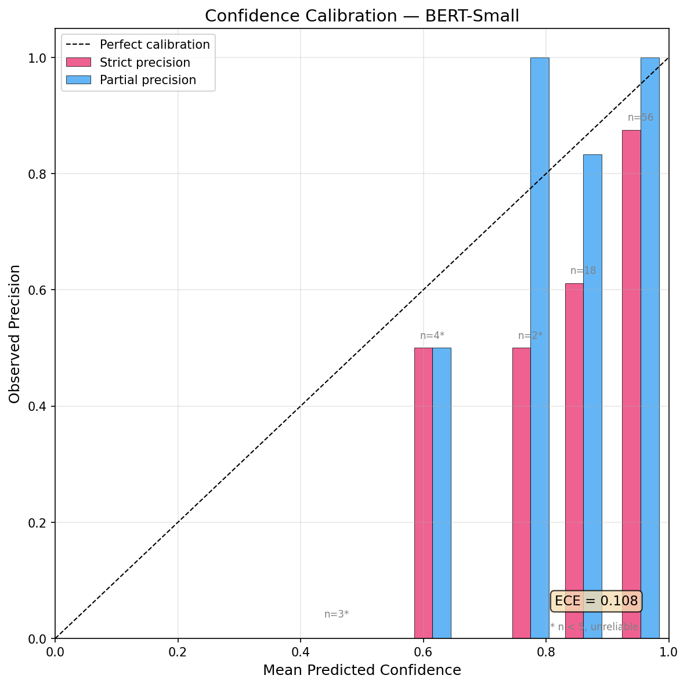
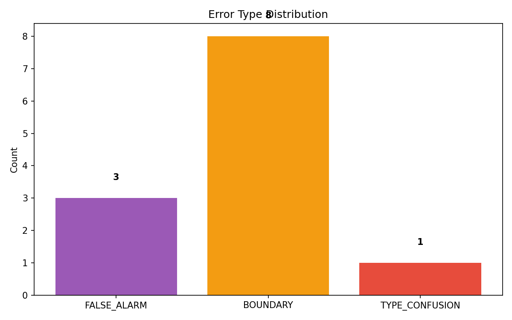
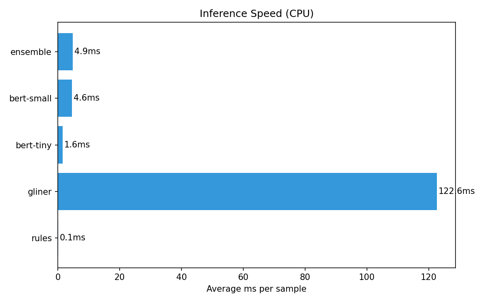
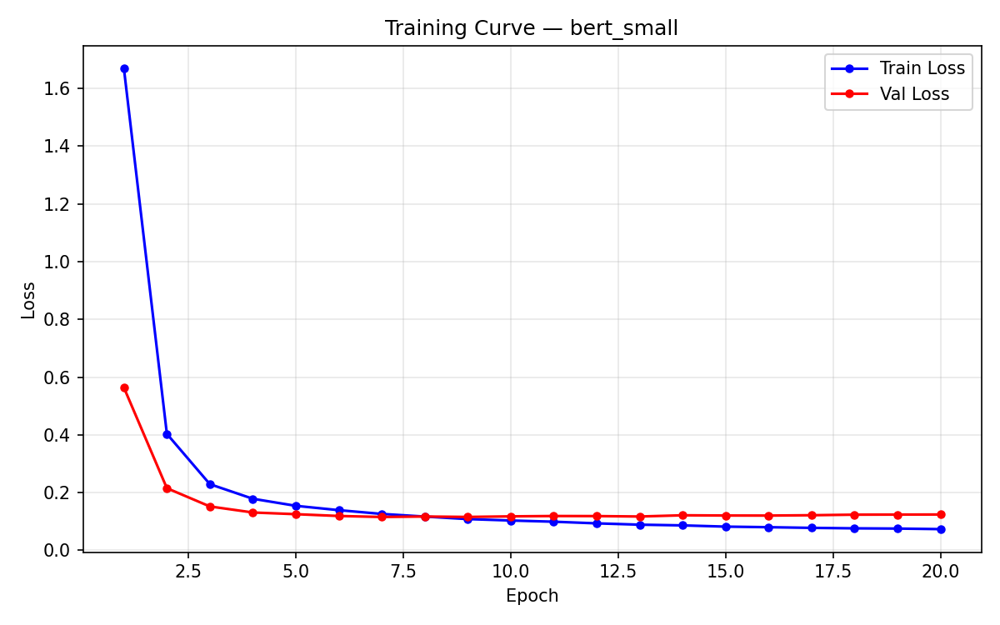
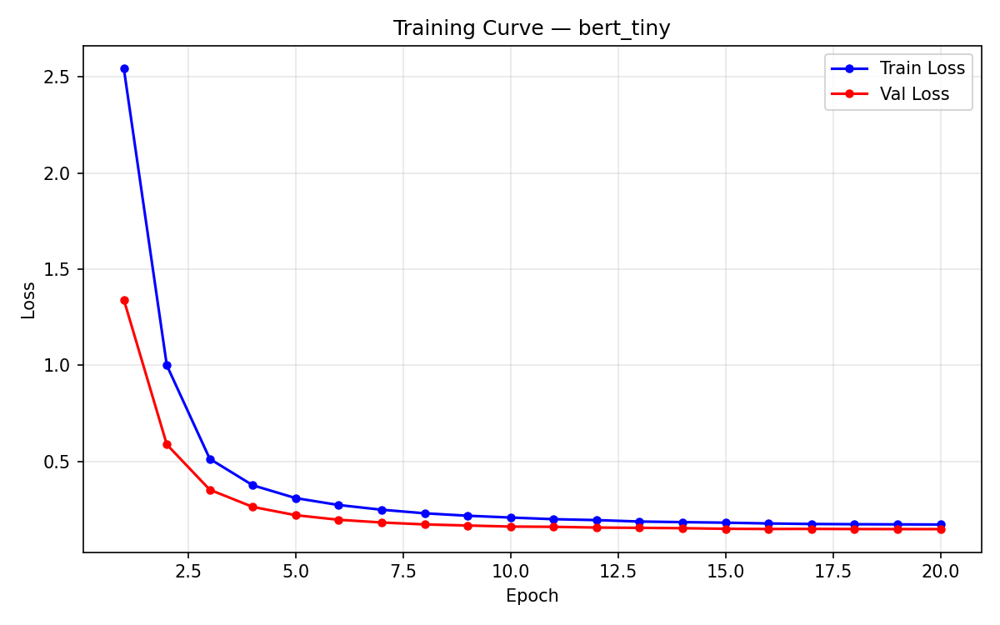

# Evaluation Report

Auto-generated evaluation results.

## Model Comparison

### Strict Match

| Model | Precision | Recall | F1 | TP | FP | FN |
|-------|-----------|--------|-----|-----|-----|-----|
| rules | 0.778 | 0.553 | 0.646 | 42 | 12 | 34 |
| gliner | 0.648 | 0.750 | 0.695 | 57 | 31 | 19 |
| bert-tiny | 0.644 | 0.763 | 0.699 | 58 | 32 | 18 |
| bert-small | 0.759 | 0.829 | 0.792 | 63 | 20 | 13 |
| ensemble | 0.852 | 0.908 | 0.879 | 69 | 12 | 7 |

### Partial Match

| Model | Precision | Recall | F1 | TP | FP | FN |
|-------|-----------|--------|-----|-----|-----|-----|
| rules | 0.926 | 0.658 | 0.769 | 50 | 4 | 26 |
| gliner | 0.727 | 0.842 | 0.780 | 64 | 24 | 12 |
| bert-tiny | 0.811 | 0.961 | 0.879 | 73 | 17 | 3 |
| bert-small | 0.904 | 0.987 | 0.943 | 75 | 8 | 1 |
| ensemble | 0.926 | 0.987 | 0.955 | 75 | 6 | 1 |

## Per-Entity-Type Breakdown (All Models, Strict Match)

### CONTRACT_ID

| Model | Precision | Recall | F1 | Support |
|-------|-----------|--------|-----|---------|
| rules | 1.000 | 1.000 | 1.000 | 15 |
| gliner | 0.929 | 0.867 | 0.897 | 15 |
| bert-tiny | 0.474 | 0.600 | 0.529 | 15 |
| bert-small | 0.562 | 0.600 | 0.581 | 15 |
| ensemble | 1.000 | 1.000 | 1.000 | 15 |

### EMAIL

| Model | Precision | Recall | F1 | Support |
|-------|-----------|--------|-----|---------|
| rules | 0.636 | 0.636 | 0.636 | 11 |
| gliner | 0.727 | 0.727 | 0.727 | 11 |
| bert-tiny | 0.538 | 0.636 | 0.583 | 11 |
| bert-small | 0.818 | 0.818 | 0.818 | 11 |
| ensemble | 0.818 | 0.818 | 0.818 | 11 |

### ISSUE_DATE

| Model | Precision | Recall | F1 | Support |
|-------|-----------|--------|-----|---------|
| rules | 0.800 | 0.750 | 0.774 | 16 |
| gliner | 0.444 | 0.500 | 0.471 | 16 |
| bert-tiny | 0.700 | 0.875 | 0.778 | 16 |
| bert-small | 0.778 | 0.875 | 0.824 | 16 |
| ensemble | 0.778 | 0.875 | 0.824 | 16 |

### NAME

| Model | Precision | Recall | F1 | Support |
|-------|-----------|--------|-----|---------|
| rules | 0.615 | 0.500 | 0.552 | 16 |
| gliner | 0.517 | 0.938 | 0.667 | 16 |
| bert-tiny | 0.632 | 0.750 | 0.686 | 16 |
| bert-small | 0.800 | 1.000 | 0.889 | 16 |
| ensemble | 0.842 | 1.000 | 0.914 | 16 |

### PRODUCT

| Model | Precision | Recall | F1 | Support |
|-------|-----------|--------|-----|---------|
| rules | 0.000 | 0.000 | 0.000 | 18 |
| gliner | 0.812 | 0.722 | 0.765 | 18 |
| bert-tiny | 0.842 | 0.889 | 0.865 | 18 |
| bert-small | 0.833 | 0.833 | 0.833 | 18 |
| ensemble | 0.833 | 0.833 | 0.833 | 18 |

## Noise Robustness (Gold Noisy Subset)

### Strict Match

| Model | Precision | Recall | F1 | TP | FP | FN |
|-------|-----------|--------|-----|-----|-----|-----|
| rules | 0.556 | 0.357 | 0.435 | 45 | 36 | 81 |
| gliner | 0.532 | 0.667 | 0.592 | 84 | 74 | 42 |
| bert-tiny | 0.264 | 0.381 | 0.312 | 48 | 134 | 78 |
| bert-small | 0.493 | 0.595 | 0.540 | 75 | 77 | 51 |
| ensemble | 0.694 | 0.738 | 0.715 | 93 | 41 | 33 |

### Partial Match

| Model | Precision | Recall | F1 | TP | FP | FN |
|-------|-----------|--------|-----|-----|-----|-----|
| rules | 0.765 | 0.492 | 0.599 | 62 | 19 | 64 |
| gliner | 0.658 | 0.825 | 0.732 | 104 | 54 | 22 |
| bert-tiny | 0.527 | 0.762 | 0.623 | 96 | 86 | 30 |
| bert-small | 0.737 | 0.889 | 0.806 | 112 | 40 | 14 |
| ensemble | 0.843 | 0.897 | 0.869 | 113 | 21 | 13 |

### Per-Entity Breakdown (Noisy Subset, Strict Match)

| Model | CONTRACT_ID | EMAIL | ISSUE_DATE | NAME | PRODUCT |
|-------|------|------|------|------|------|
| rules | 0.857 | 0.489 | 0.300 | 0.275 | 0.000 |
| gliner | 0.682 | 0.511 | 0.610 | 0.667 | 0.453 |
| bert-tiny | 0.174 | 0.267 | 0.355 | 0.492 | 0.269 |
| bert-small | 0.102 | 0.667 | 0.630 | 0.697 | 0.625 |
| ensemble | 0.857 | 0.708 | 0.641 | 0.708 | 0.667 |

## Secondary Test Set (LLM-Generated, n=110)

**Note:** This test set was generated by GPT-4o-mini with non-overlapping entity pools.
100% of samples required auto-offset-correction. Results reported separately from gold set
due to circular evaluation risk (same LLM family generated training and test data).

### Strict Match

| Model | Precision | Recall | F1 | TP | FP | FN |
|-------|-----------|--------|-----|-----|-----|-----|
| rules | 0.681 | 0.687 | 0.684 | 156 | 73 | 71 |
| gliner | 0.728 | 0.802 | 0.763 | 182 | 68 | 45 |
| bert-tiny | 0.564 | 0.586 | 0.575 | 133 | 103 | 94 |
| bert-small | 0.754 | 0.784 | 0.769 | 178 | 58 | 49 |
| ensemble | 0.773 | 0.797 | 0.785 | 181 | 53 | 46 |

### Partial Match

| Model | Precision | Recall | F1 | TP | FP | FN |
|-------|-----------|--------|-----|-----|-----|-----|
| rules | 0.734 | 0.740 | 0.737 | 168 | 61 | 59 |
| gliner | 0.844 | 0.929 | 0.885 | 211 | 39 | 16 |
| bert-tiny | 0.801 | 0.833 | 0.816 | 189 | 47 | 38 |
| bert-small | 0.898 | 0.934 | 0.916 | 212 | 24 | 15 |
| ensemble | 0.906 | 0.934 | 0.920 | 212 | 22 | 15 |

## Inference Speed (CPU)

| Model | Avg ms/sample |
|-------|---------------|
| rules | 0.1 |
| gliner | 122.6 |
| bert-tiny | 1.6 |
| bert-small | 4.6 |
| ensemble | 4.9 |

## Error Analysis Summary

Total errors: 12

| Error Type | Count |
|------------|-------|
| FALSE_ALARM | 3 |
| BOUNDARY | 8 |
| TYPE_CONFUSION | 1 |

## Figures

### Calibration

### Error Distribution

### Inference Speed

### Latency Vs Accuracy

### Learning Curve Bert Small

### Learning Curve Bert Tiny

